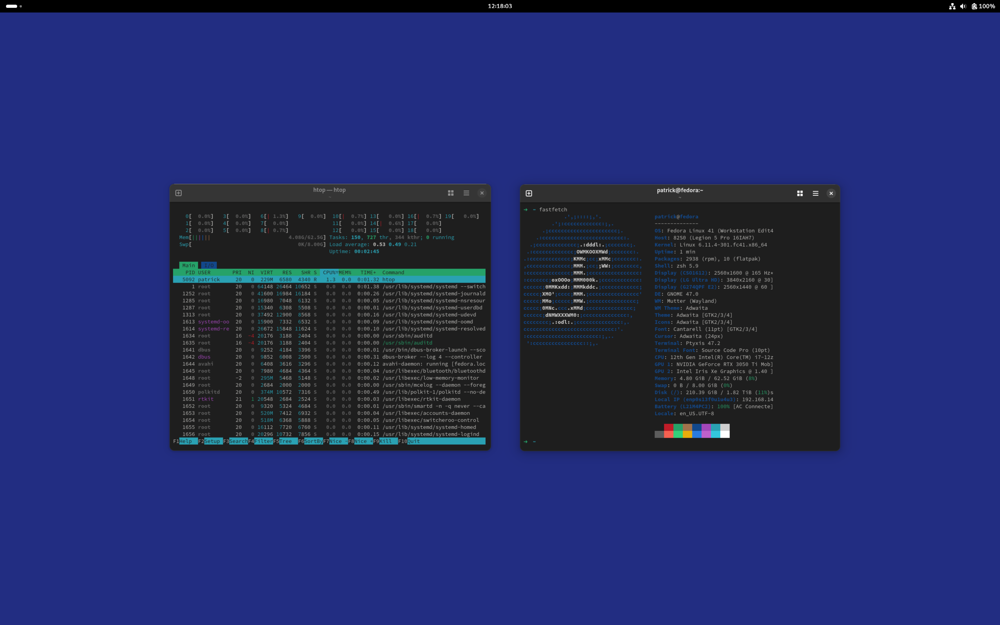

# Workstation

## Operating System Support

| Operating System | Release | Date Tested |
| ---------------- | ------- | ----------- |
| Fedora           | 43      | 2026-01-31 |

## Screenshots



## Installation

### Root

```bash
bash -c "$(curl -fsSl https://raw.githubusercontent.com/PatrickMurray/workstation/HEAD/install.sh)"
```

### Local Development

```bash
sudo su -

# Default workstation
ansible-playbook \
  --inventory inventory.yml \
  main.yml;

# Slim workstation
ansible-playbook \
  --inventory inventory.yml \
  --extra-vars "workstation_type=slim" \
  main.yml;
```


## Manual Steps

### Tailscale Network Configuration

This playbook automatically configures workstations to join the Tailscale mesh network using an auth key stored in `roles/network/defaults/main.yml`.

#### Key Management

**Important**: Tailscale auth keys have a maximum expiration of 90 days due to Tailscale API limitations. You must periodically re-issue the auth key to maintain network connectivity.

##### Generate Auth Key:

1. Navigate to the infracode repository: [github.com/patrickmurray/infracode](https://github.com/patrickmurray/infracode)

2. Apply the Terraform configuration to generate a new auth key:
   ```bash
   terraform apply
   ```

3. Get the new auth key:
   ```bash
   terraform output mesh_network_auth_keys
   ```

4. Update the workstation repository with the new key
   ```bash
   ansible-vault decrypt roles/network/defaults/main.yml
   # Edit
   ansible-vault encrypt roles/network/defaults/main.yml
   ```

5. Commit and push the updated key:
   ```bash
   git add roles/network/defaults/main.yml
   git commit -m "Update Tailscale auth key"
   git push
   ```