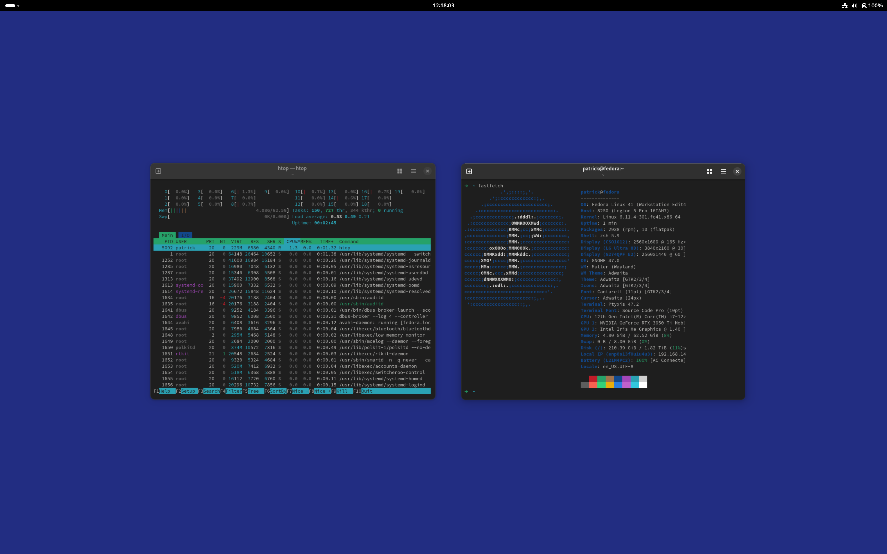

# Workstation Configuration


## Operating System Support

| Operating Systemn | Release | Date Tested |
| ----------------- | ------- | ----------- |
| Fedora            | 41      | 2025-03-16  |


## Screenshots




## Installation


### Root

```bash
bash -c "$(curl -fsSl https://raw.githubusercontent.com/PatrickMurray/workstation/HEAD/install.sh)"
```

